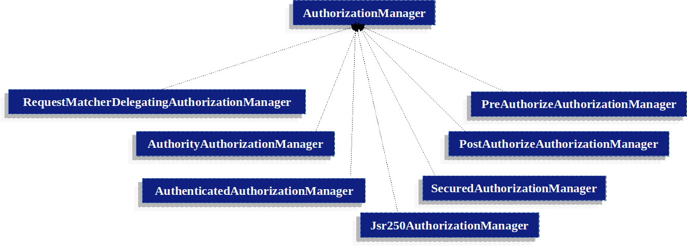



---
# 🏛️ GrantedAuthority
사용자(principal, 주체)에게 부여된 권한을 나타내는 인터페이스이다.
모든 `Authentication` 구현체들은 `GrantedAuthority` 타입 객체들의 리스트를 가지고 있다. ([`Authentication`](https://ijnooyah.github.io/spring-security/authentication-architecture/#-authentication) 코드 부분 참고)   

`GrantedAuthority` 객체들은 [`AuthenticationManager`](https://ijnooyah.github.io/spring-security/authentication-architecture/#-authenticationmanager)에 의해 Authentication 객체에 삽입된다.

`SimpleGrantedAuthority`는 `GrantedAuthority`의 구현체로, 대부분의 [`AuthenticationProvider`](https://ijnooyah.github.io/spring-security/authentication-architecture/#-authenticationprovider) 구현체들은 `SimpleGrantedAuthority`를 사용해 `Authentication`를 채운다. <!-- 예를 들어, UserDetailsService에서 UserDetails를 반환할 때 SimpleGrantedAuthority를 사용하여 사용자의 권한을 설정합니다. -->

<!-- 복잡한 GrantedAuthority 부분 공식문서에 있는데 지금은 반정도 이해함 이해 다되면 정리할 것-->
기본적으로 역할 기반의 인가 규칙(role-based authorization)은 역할 앞에 `ROLE_`를 접두사로 사용한다. 예를 들어, 보안 컨텍스트가 "USER" 역할을 필요로 하는 인가 규칙이 있다면 스프링 시큐리티는 기본적으로 `GrantedAuthority#getAuthority`가 "ROLE_USER"를 반환하는지 확인한다.

접두사는 `GrantedAuthorityDefaults`를 사용해 커스텀 할 수 있다. 이부분은 [공식문서](https://docs.spring.io/spring-security/reference/servlet/authorization/architecture.html#authz-authorities)를 확인하자. 

# 👮 AuthorizationManager
`AuthorizationManager` 인터페이스는 스프링 시큐리티의 요청 기반, 메소드 기반, 메시지 기반의 인가 구성 요소에서 호출되며, 접근 제어 결정을 내리는 최종 책임자이다. [이전에 사용되던 `AccessDecisionManager`와 `AccessDecisionVoter`를 대체한다.](#-accessdecisionmanager와-accessdecisionvoter)

<b>주요 메서드:</b>
- `check`: 접근 허용 여부를 결정한다
  - 인가 결정을 내리는 데 필요한 모든 정보(인증 객체와 보안 대상 객체(예: 권한 정보, 요청 정보, 호출 정보 등))를 입력받아, 접근이 허용되는지 여부를 판단한다.
  - 반환 값은 `AuthorizationDecision` 객체로, 접근 허용(`true`), 접근 거부(`false`), 결정 유보(`null`) 중 하나이다.
  - 예시: 메서드 호출에 대한 보안을 검사할 때, 메서드의 인자를 검사하여 현재 사용자가 그 작업을 수행할 권한이 있는지 확인할 수 있다.
- `verify`: `check` 메서드를 호출해서 접근 허용 여부를 검사한 후, 만약 접근이 거부되면 `AccessDeninedException`을 던진다.

요약하자면, `AuthorizationManager`는 스프링 시큐리티에서 "이 사용자가 여기에 접근할 수 있나요?"라는 질문에 대한 대답(접근 제어 결정)을 한다.

## 🎭 위임 기반 AuthorizationManager 구현체
커스텀 `AuthorizationManager`를 통해서도 인가 과정을 제어할 수 있지만, 스프링 시큐리티에서 기본적으로 제공하는 위임 `AuthorizationManager`를 사용하면 여러 `AuthorizationManager`와 협력해서 관리할 수 있다.



`RequestMatcherDelegatingAuthorizationManager`는 요청을 가장 적절한 `AuthorizationManager`와 매칭시켜 준다.   
메소드 보안(Method Security)에서는 `AuthorizationManagerBeforeMethodInterceptor`와 `AuthorizationManagerAfterMethodInterceptor`를 사용할 수 있다.

| 구현체 | 특징 |
| --- | --- |
| `AuthorityAuthorizationManager` | 특정 권한을 가진 사용자에게만 접근을 허용한다. 주로 사용자의 권한(예: ROLE_USER, ROLE_ADMIN)을 기반으로 접근을 제어한다. |
| `AuthenticatedAuthorizationManager` | 인증된 사용자에게 접근을 허용한다. 이 클래스는 사용자가 시스템에 로그인했는지 여부를 기준으로 결정한다. |
| `WebExpressionAuthorizationManager` | 웹 보안 표현식을 사용하여 권한을 관리한다. 예를 들어, "hasRole('ADMIN')" 또는 "hasAuthority('WRITE_PERMISSIONS')"과 같은 표현식을 사용할 수 있다. |
| `RequestMatcherDelegatingAuthorizationManager` | 인가 설정에서 지정한 모든 요청 패턴과 권한 규칙을 매핑한 정보를 가지고 있으며, 권한 검사 시 가장 적합한 AuthorizationManager 구현체를 선택해 위임한다. |
| `PreAuthorizeAuthorizationManager` | 메소드 실행 전에 권한을 검사한다. @PreAuthorize 어노테이션과 함께 사용되며, 메소드 실행 전에 사용자의 권한을 확인한다. |
| `PostAuthorizeAuthorizationManager` | 메소드 실행 후에 권한을 검사한다. @PostAuthorize 어노테이션과 함께 사용되며, 메소드 실행 후 결과에 따라 접근을 허용하거나 거부한다. |
| `Jsr250AuthorizationManager` | JSR-250 어노테이션(@RolesAllowed, @DenyAll, @PermitAll)을 사용하여 권한을 관리한다. |
| `SecuredAuthorizationManager` | @Secured 어노테이션을 사용하여 메소드 수준의 보안을 제공한다. 이 어노테이션은 특정 권한을 가진 사용자만 메소드에 접근할 수 있게 한다. |


# 🗂️ 계층적 역할 (Hierarchical Roles)
많은 애플리케이션에서 사용자는 단일 역할만을 갖는 것이 아니라, 여러 역할이 계층적으로 구성되어 있는 경우가 많다. ("admin"과 "user" 역할이 있는 애플리케이션에서 "admin"에게 "user"의 역할도 함께 할당해야 하는 경우 등) 
이때 계층적 역할(Hierarchical Roles)을 활용하면 보안 관리가 훨씬 간편해진다.

<b>역할 계층 구성 방법</b>  
Java 코드와 XML 코드로 구성할 수 있는데, 여기서는 자바 코드만 보여주겠다. XML 코드는 [공식문서](https://docs.spring.io/spring-security/reference/servlet/authorization/architecture.html#authz-hierarchical-roles)를 참고하자.

```java
@Bean
static RoleHierarchy roleHierarchy() {
    return RoleHierarchyImpl.withDefaultRolePrefix()
        .role("ADMIN").implies("STAFF")
        .role("STAFF").implies("USER")
        .role("USER").implies("GUEST")
        .build();
}

// pre-post 메서드 보안도 사용하는 경우 추가로 설정
@Bean
static MethodSecurityExpressionHandler methodSecurityExpressionHandler(RoleHierarchy roleHierarchy) {
    DefaultMethodSecurityExpressionHandler expressionHandler = new DefaultMethodSecurityExpressionHandler();
    expressionHandler.setRoleHierarchy(roleHierarchy);
    return expressionHandler;
}
```

위 설정에서 `ROLE_ADMIN`은 `ROLE_STAFF`를 포함하며, `ROLE_STAFF`는 `ROLE_USER`를 포함하고, `ROLE_USER`는 `ROLE_GUEST`를 포함하는 구조이다. 따라서 `ROLE_ADMIN`으로 인증된 사용자는 모든 하위 역할인 `ROLE_STAFF`, `ROLE_USER`, `ROLE_GUEST`를 가진 것으로 간주된다.

# 🦖 AccessDecisionManager와 AccessDecisionVoter
`AuthorizationManager`는 Spring Security 5.5부터 도입된 새로운 인가 결정 인터페이스이다. `AccessDecisionManager`와 `AccessDecisionVoter`를 대체해서 얻은 장점 설명은 추후 서술하겠다.

---

<p class="ref">참고</p>
- [스프링 시큐리티 공식문서](https://docs.spring.io/spring-security/reference/servlet/authorization/architecture.html){: target="_blank"}
- [스프링 시큐리티 완전 정복](https://www.inflearn.com/course/%EC%8A%A4%ED%94%84%EB%A7%81-%EC%8B%9C%ED%81%90%EB%A6%AC%ED%8B%B0-%EC%99%84%EC%A0%84%EC%A0%95%EB%B3%B5/dashboard){: target="_blank"}

